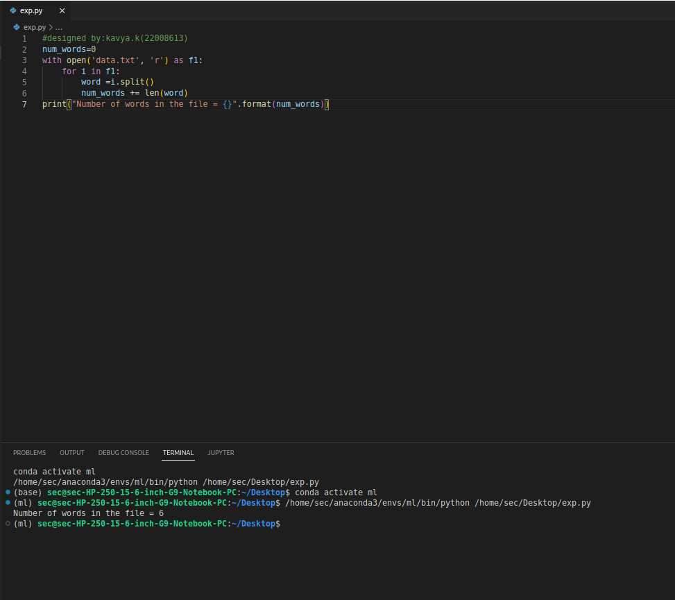
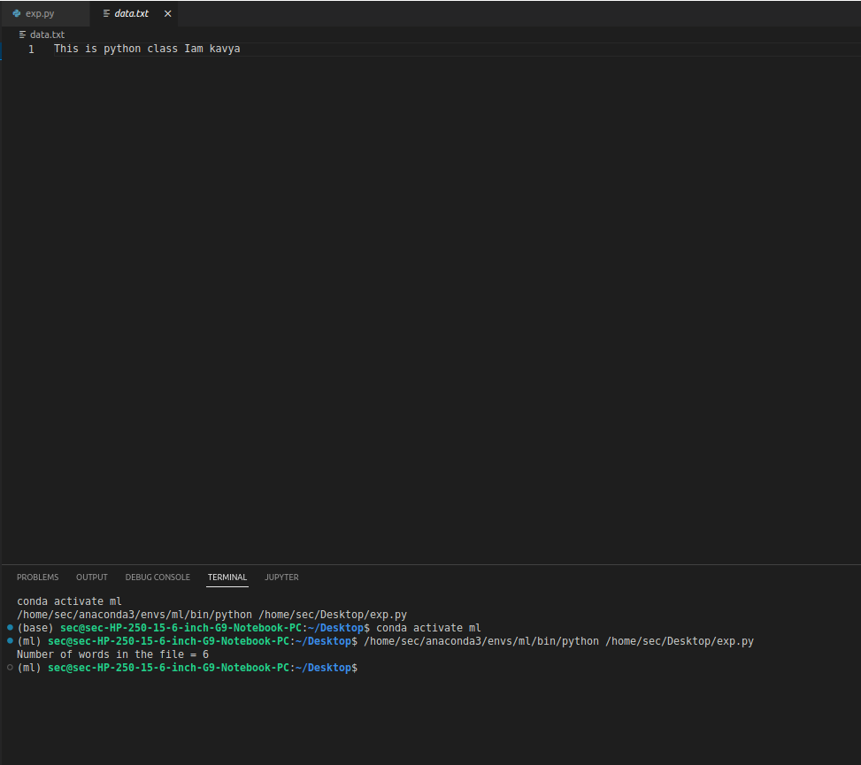

# Word-count
## AIM:
To write a python program for getting the word count from a text.
## EQUIPEMENT'S REQUIRED: 
PC
Anaconda - Python 3.7
## ALGORITHM: 
### Step 1:
Open the in read mode and handle it in text mode.

## Step 2:
Read the text using the read() function.

## Step 3:
Split the text using space seperator. We assume that words in a sentence are seperated by a space character.

## Step 4:
The length of the split list should equal the number of words in the text file.

## Step 5:
You can refine the count by cleaning the string prior to splitting or validating the words after splitting.

## Step 6:
End the program.

## PROGRAM:
```python
#Developed by: kavya.k
#Reference number:22008613

num_words =0
with open('text1.txt','r') as file1:
    for i in file1:
        word =i.split()
        num_words += len(word)
print("Number of words={}".format(num_words))
```
### OUTPUT:




## RESULT:
Thus the program is written to find the word count from a text.
